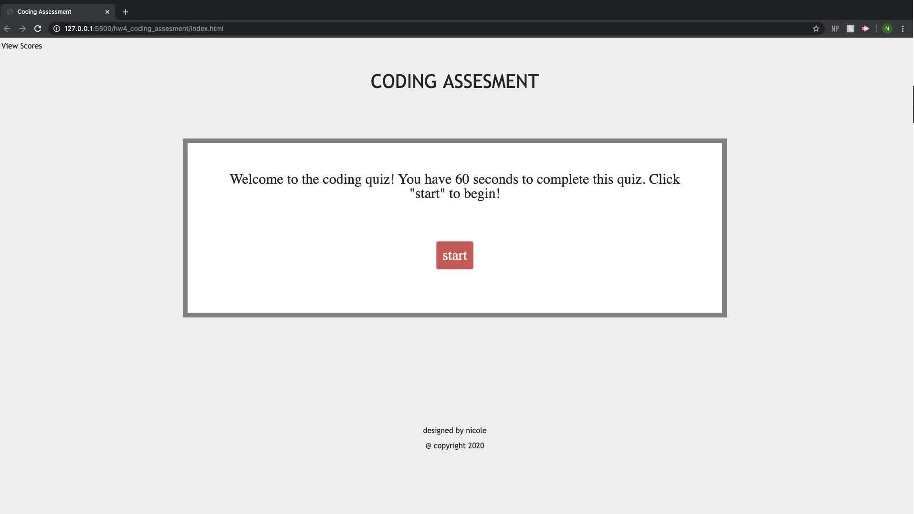
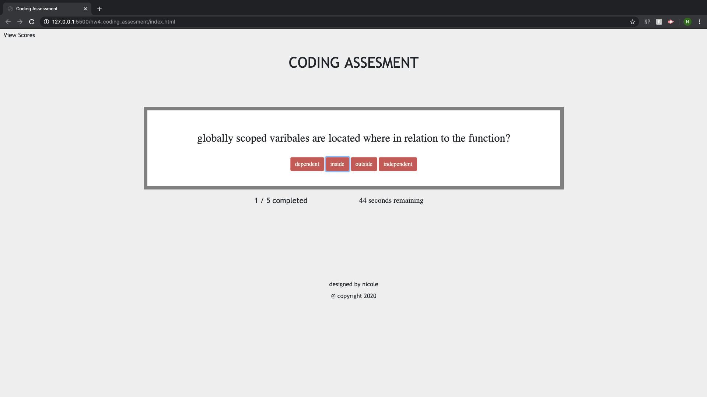
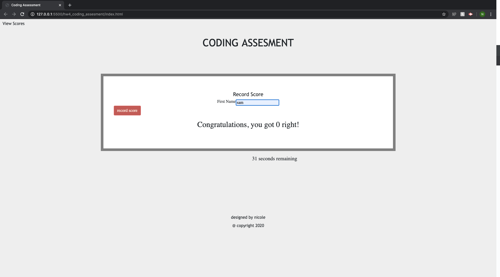
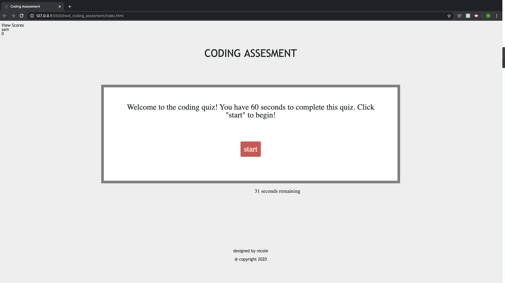

# hw4_coding_assesment
coding assessment 

In this project, I have created a coding assessment quiz.  This quiz is multiple choice and has interactive challenges. 

You have 60 seconds to complete the quiz. When you answer a question right, you will gain a point, if you answer the question incorrectly, you lose 5 seconds from your time. The quiz also shows your quiz progress and the time left; both of these elements clear out and go back to their starting values when the record score button is clicked. 

I have made this quiz dynamic through JavaScript. It features only one HTML and elements that appear and disappear with the help of CSS display, and appending new elements to the page with Javascript. The quiz is also mobile responsive and adapts to the users screen size. 

This quiz also uses local storage to keep track of the user's score. The quiz then appends the user's score to the top of the page. 

## Images of Completed Website 

### Step 1

### Step 2

### Step 3

### Step 4

## Link to Site

Deployed website [password generator](https://nicoleremy95.github.io/hw4_coding_assesment/)

## Contributing
Pull requests are welcome. For major changes, please open an issue first to discuss what you would like to change.

Please make sure to update tests as appropriate.

## License
[NER](https://choosealicense.com/licenses/mit/)